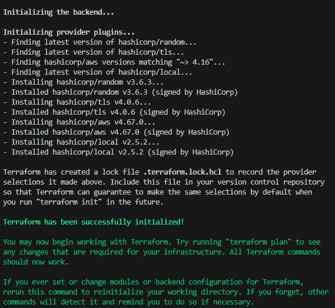
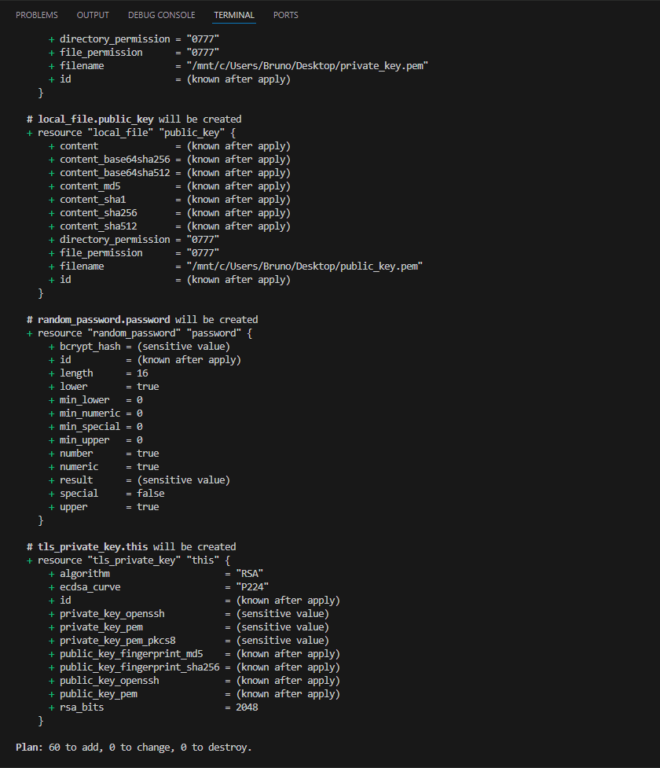
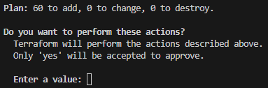
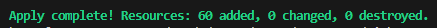
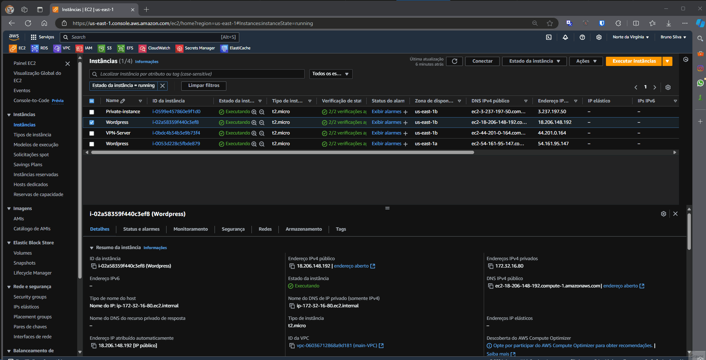
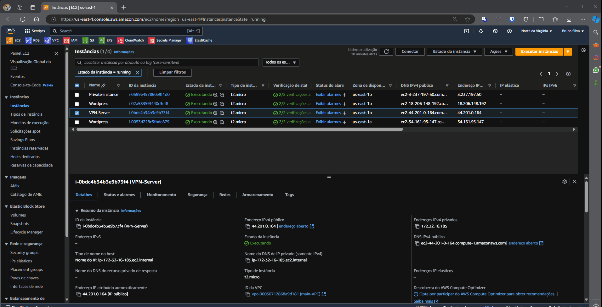

# README

<h1> Professional Service - Elven Works</h1>

## 📜Sobre

<p>Este projeto foi desenvolvido perante um teste de conhecimento sobre SRE proposto pela empresa Elven Works, privisionando recursos da cloud da AWS com alta disponibilidade e segurança.</p>
<p>Seu objetivo é implementar uma aplicação WordPress em alta disponibilidade na AWS. Utiliza Auto Scaling para escalabilidade automática, EFS para armazenamento compartilhado de mídia, RDS para um banco de dados MySQL gerenciado e Load Balancer para distribuir o tráfego entre as instâncias EC2. Além disso, inclui uma instância EC2 privada rodando um container Docker com uma aplicação “Hello World” e um servidor VPN Pritunl para acesso seguro à instância privada.</p>
<p>Alguns métodos utilizados no código incluem a criação do Par de Chaves e utilização na criação da Instância, criação de uma senha aleatória para o banco de dados (que é armazenado no Secret Manager da AWS), intalação do Wordpress de forma automatizada utilizando Ansible, provisionamento de alarmes do cloudWatch monitorando métricas importantes (alarmando no e-mail caso necessário) e o provisionamento do Recurso Elasticache da AWS (para cachear queries ao banco de dados e otimizar as consultas do wordpress).</p>

### Tabela de Conteúdos

* [Sobre](#📜sobre)
* [Tabela de conteúdos](#tabela-de-conteúdos)
* [Tecnologias](#🛠️tecnologias)
* [Pré Requisitos](#pré-requisitos)
* [Instalação](#instalação)
  * [Preparação](#preparação)
  * [Execução](#execução)
* [Demonstração](#demonstração)
* [Configuração da VPN](#configuração-da-vpn)


## 🛠️Tecnologias

- [Terraform](https://www.terraform.io/)
- [AWS](https://aws.amazon.com/pt/?nc2=h_lg)
- [Pritunl](https://pritunl.com/)
- [Ansible](https://docs.ansible.com/ansible/latest/index.html)
- [Docker](https://www.docker.com/)

## Pré Requisitos

- Conta válida na AWS cum um usuário configurado.
- Terraform instalado utilizando tfenv 1.1.7
- Terminal Linux

## Instalação

### Preparação

Primeiro vamos instalar o Terraform com o tfenv para execução do código e o aws-cli para configuirarmos profile da AWS. Você pode instalar através da documentação oficial: [Terraform](https://developer.hashicorp.com/terraform/install), [TFENV](https://github.com/tfutils/tfenv), [AWS-cli](https://docs.aws.amazon.com/cli/latest/userguide/getting-started-install.html#getting-started-install-instructions).
Ou execute os seguintes comandos para executar um arquivo de instalação para o terraform com o tfenv e o aws-cli.

```bash
# Traga o arquivo do repositório S3
$ wget https://s3.amazonaws.com/ansible.wordpress/install_terraform.sh

# Execute o arquivo de instalação
$ ./install_terraform.sh
```

Conteúdo do arquivo:
```bash
wget -O- https://apt.releases.hashicorp.com/gpg | sudo gpg --dearmor -o /usr/share/keyrings/hashicorp-archive-keyring.gpg
echo "deb [signed-by=/usr/share/keyrings/hashicorp-archive-keyring.gpg] https://apt.releases.hashicorp.com $(lsb_release -cs) main" | sudo tee /etc/apt/sources.list.d/hashicorp.list
sudo apt update && sudo apt install terraform
git clone --depth=1 https://github.com/tfutils/tfenv.git ~/.tfenv
echo 'export PATH="$HOME/.tfenv/bin:$PATH"' >> ~/.bash_profile
echo 'export PATH="$HOME/.tfenv/bin:$PATH"' >> ~/.zprofile
echo 'export PATH=$PATH:$HOME/.tfenv/bin' >> ~/.bashrc
ln -s ~/.tfenv/bin/* /usr/local/bin
mkdir -p ~/.local/bin/
. ~/.profile
ln -s ~/.tfenv/bin/* ~/.local/bin
which tfenv
tfenv install 1.1.7
tfenv use 1.1.7
```

Instalando o AWS-cli e clonando o repositório:
```bash
#Instalação do aws-cli 
$ curl "https://awscli.amazonaws.com/awscli-exe-linux-x86_64.zip" -o "awscliv2.zip"
$ unzip awscliv2.zip
$ sudo ./aws/install

#Execute o comando e adicione sua Acess Key ID, Secret Key do seu usuário AWS, região default e o formato de saída padrão.
$ aws configure
```

### Execução

Clone o repositório
```bash
#clone do repositório
$ git clone https://github.com/BrunoDXD/professional_service.git

#Acesse a pasta dos arquivos
$ cd professional_service
```
No arquivo "02_variables.tf", altere a variável caminho para a pasta do seu código. 
Outra alteração que deve ser feita é a variável email, para receber os alertas do cloudWatch

Inicialize o backend do terraform
```bash
$ terraform init
```
<h1 align="center">
  
</h1>

Execute o plan do terraform
```bash
$ terraform plan
```
<h4 align="center">
  
  <p>Aqui são listados todos os recursos que serão adicionados</p>
</h4>


Aplique os recursos
```bash
$ terraform apply
```
<h4 align="center">
  <p>Em seguida digite Yes para prosseguir</p>
  
</h4>


<h4 align="center">
  <p>Mensagem de sucesso:</p>
  
</h4>

## Demonstração

<h4 align="center">
<p>Acessando o IP da maquina do wordpress, podemos ver sua página de primeiro acesso</p>
  
</h4>

<h4 align="center">
<p>Podemos ver o mesmo ocorrer com a instancia da VPN (Não esqueça de colocar https no link)</p>
  
</h4>

## Configuração da VPN

<h4 align="center">
<p>Acesse a pagina de login da VPN com o ip do servidor</p>
  
</h4>

<h4 align="center">
<p>Pegue o código no console da aws para se conetar a Instância da VPN</p>
  
</h4>